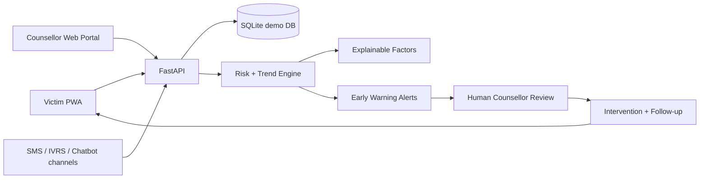

# SaathiCare AI — SIH26094 Finalist Prototype

**Problem:** AI-Powered Dynamic Mental Health Monitoring and Distress Prediction System for Victims of Atrocities

**Context:** NHAA (14566), Integrated Portal, chatbot, mobile application, IVRS and other approved channels.

## What this build demonstrates

### LIVE CORE DEMO
- Victim onboarding and anonymous case ID
- Adaptive wellbeing check-in
- Dynamic 0–100 distress screening score
- Personal baseline + longitudinal trend
- Explainable risk contributors
- Threat/safety signal detection
- Early-warning alerts
- Counsellor priority queue
- Case journey: complaint → investigation → trial → compensation → rehabilitation
- Human intervention recording + follow-up scheduling
- Court, compensation and rehabilitation context

### PROTOTYPE / DEMO MODULES
- Saathi AI conversational companion
- Voice Stress Analytics pipeline
- Journal NLP theme analysis
- SMS / IVRS simulation
- District / State / National aggregate views
- Multilingual UI architecture (English/Hindi/Telugu)
- Audit log and privacy/consent views

## Architecture



## Run locally on Windows

Requires Python 3.11+.

```powershell
python -m venv .venv
.\.venv\Scripts\Activate.ps1
pip install -r requirements.txt
python -m backend.train_model
python -m uvicorn backend.main:app --reload
```

In two additional terminals:

```powershell
python -m http.server 5173 --directory mobile
python -m http.server 5174 --directory web
```

Open:
- Victim PWA: http://127.0.0.1:5173
- Authority portal: http://127.0.0.1:5174
- API docs: http://127.0.0.1:8000/docs

### Demo credentials

**Counsellor:** `counselor@saathicare.demo` / `Demo@123`

**Victim:** `asha@saathicare.demo` / `Demo@123`

Other synthetic victim accounts use the same password:
- `meera@saathicare.demo`
- `kiran@saathicare.demo`
- `ravi@saathicare.demo`
- `sita@saathicare.demo`

## 5-minute judge demo

1. Open mobile PWA and use demo survivor.
2. Start check-in; select elevated anxiety/sleep/safety/threat/court responses.
3. Show 0–100 score, baseline change, trend and explainable factors.
4. Open Case Journey and show court/compensation/rehabilitation context.
5. Open authority portal and show the new early-warning alert.
6. Open the case to show longitudinal chart and contributing factors.
7. Record an intervention and schedule a follow-up.
8. Quickly show Voice AI, SMS/IVRS, District, State and National modules as the broader deployment architecture.

## Ethical positioning

This is a **screening/risk-estimation prototype, not a medical diagnosis system**. It uses synthetic data. AI outputs require human interpretation and must not automatically determine legal entitlement, protection status, medical treatment, or emergency decisions.

Before real deployment, replace demo authentication and resources with audited systems, verified local support pathways, encryption, formal consent/audit controls, clinical/field validation, threat modelling, and government-approved integration protocols.
