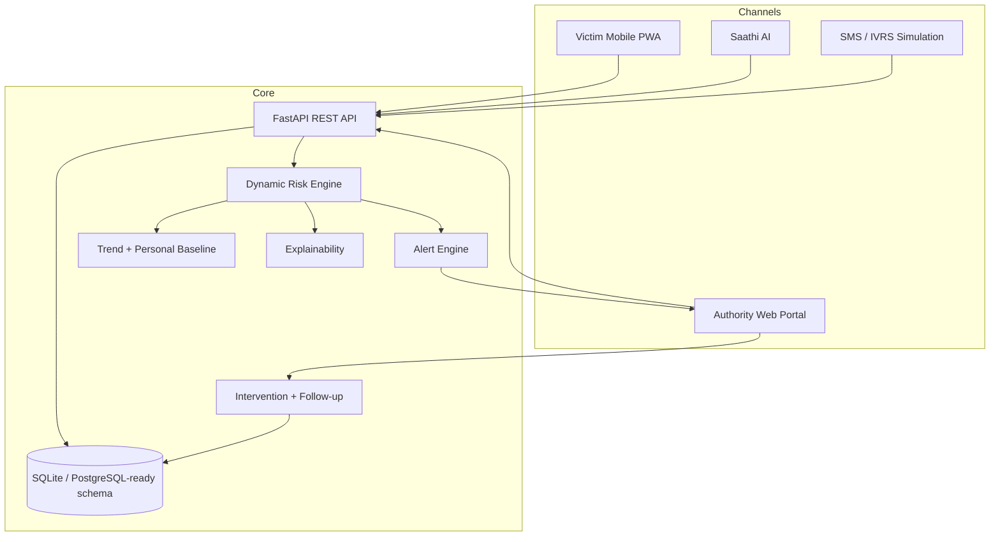

# Architecture

```mermaid
flowchart TB
  subgraph Channels
    M[Victim Mobile PWA]
    B[Saathi AI]
    S[SMS / IVRS Simulation]
    W[Authority Web Portal]
  end
  subgraph Core
    API[FastAPI REST API]
    DB[(SQLite / PostgreSQL-ready schema)]
    R[Dynamic Risk Engine]
    T[Trend + Personal Baseline]
    X[Explainability]
    A[Alert Engine]
    I[Intervention + Follow-up]
  end
  M --> API
  B --> API
  S --> API
  W --> API
  API --> DB
  API --> R
  R --> T
  R --> X
  R --> A
  A --> W
  W --> I
  I --> DB
```

The prototype deliberately separates AI screening from human decision-making.
